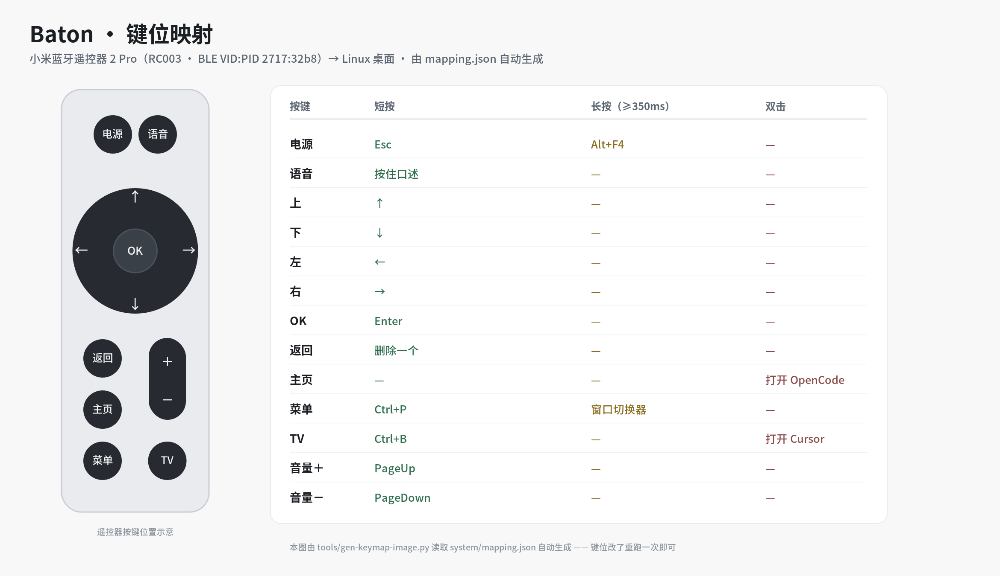

<p align="center"></p>

# Baton Mi · Xiaomi BLE Voice Remote → Linux Desktop

[](LICENSE)

-orange)


**English** · [中文说明](README.zh-CN.md)

**Vibe-code from the couch.** Baton Mi turns a cheap Xiaomi Bluetooth voice remote into a hands-free controller
for your AI coding agent on Linux: **hold to talk** (offline speech-to-text), **tap to interrupt** the model,
and **switch windows** between the agent, the editor and the browser — without touching the keyboard.

Built for **GNOME / Wayland**, where the usual key-injection tools (`wtype`, `xdotool`) simply do not work —
so this project ships its own ~250-line **uinput injection shim** (30 ms per keypress, versus 2.1 s for
the naive "create a virtual device every time" approach).

> Detailed docs (keymap rationale, full reproduction steps, 11 documented pitfalls) are in Chinese under [`docs/`](docs/).

```
Remote buttons ──BLE HID──► mi-remote (action engine) ──► uinput shim ──► desktop
Remote mic     ──BLE ATVV─► IMA ADPCM decode ──► local Paraformer ASR ──► clipboard ──► Ctrl+Shift+V
```

## The AI-agent loop, on one remote

The moves you repeat all day while an agent writes your code — and the button that does each one:

| What you want | Press | What happens |
|---|---|---|
| Dictate the next prompt | **hold Voice** | push-to-talk → local ASR (~150 ms) → pasted into the focused window. No IME switching, no cloud |
| Stop the model mid-answer | **tap Power** | `Esc`, instantly: the double-tap test is gone, so pressing it again never misfires |
| Unblock a stuck agent | **tap TV** | `Ctrl+B` (OpenCode: push the blocking tool to the background) |
| Jump between agent / editor / browser | **hold Menu**, then `←`/`→` | a real switcher over **all** windows (`Alt+Tab` only toggles the last two) |
| Open the agent or the editor | **double-tap Home** / **TV** | launches OpenCode / Cursor, raising the existing window instead of duplicating it |
| Fix a typo in your prompt | **tap Back** | `Backspace`, instant (tap repeatedly to delete fast) |
| Scroll a long answer | **Volume ±** | `PageUp` / `PageDown` |
| Check it is still alive | glance at the tray | 🟢 / 🟡 / 🔴, plus a desktop notification when the remote drops |

Your hands never leave the remote, and the microphone is on the remote — so you can dictate from across the
room, not just from your desk.

## Features

- 🎙️ **Push-to-talk**: hold the mic key, speak, release — the transcription is pasted into the focused window
  (fully local ASR, ~150 ms, no network, no account)
- ⏹️ **Instant interrupt**: `Esc` on the Power key with no double-tap delay — safe to press repeatedly
- 🚀 **One-press launch**: double-press *Home* → OpenCode, double-press *TV* → Cursor; if the target folder is
  already open, the existing window is **raised instead of duplicated**
- 🪟 **Real window switcher**: long-press *Menu*, then `←/→` cycles through **all** windows
  (plain `Alt+Tab` can only toggle between the last two)
- ⌨️ **Sensible 13-key layout**: delete, Enter, arrows, `Esc`, `PageUp/PageDown`, `Ctrl+B`, … (see table below)
- 🖥️ **Tray indicator**: 🟢 healthy / 🟡 keys work but voice link is down / 🔴 service or input node broken;
  sends a **desktop notification on disconnect** ("press any key to wake it")
- 🔌 **Starts at login**: remote service + injection daemon + tray
- 🧩 **Reproducible**: idempotent `install.sh`; every pitfall and verification step is written down in `docs/`

## Quick start

Requirements:

- **GNOME on Wayland** (that's the whole point; X11 has simpler options)
- [goodtiger/mi-remote-linux](https://github.com/goodtiger/mi-remote-linux) installed and the remote paired
  (steps 1–5 in `docs/指南.md`)
- Flutter 3.2x+ (only for the tray app)

```bash
git clone https://github.com/chenweidu666/Baton.git
cd Baton
./install.sh          # deploy scripts / udev rule / systemd units / tray app + autostart
mi-remote doctor      # self-check (expect: 12 pass / 1 warning / 0 fail)
```

> `install.sh` is **idempotent**: files that already match are skipped (and if the udev rule is up to date,
> no `sudo` is needed at all). No terminal for the sudo prompt? `SUDO_PASS=yourpass ./install.sh`.

## Default keymap (edit `system/mapping.json` to change)




| Button | Tap | Hold (≥350 ms) | Double-tap |
|---|---|---|---|
| Voice | hold to talk → release to paste | — | — |
| OK | `Enter` | — | — |
| Arrows | arrow keys | — | — |
| Back | **delete one char** (instant; tap repeatedly to delete fast) | — | — |
| Home | — | — | launch **OpenCode** |
| Menu | `Ctrl+P` | **window switcher** | — |
| TV | `Ctrl+B` (OpenCode: background a blocking tool) | — | launch **Cursor** |
| Volume ± | `PageUp` / `PageDown` | — | — |
| Power | **`Esc`** (interrupt the AI / close a dialog) | close current window | — |

Full keymap with the reasoning behind every choice, the engineering log (principles, step-by-step reproduction, 11 pitfalls) and the roadmap: **[`docs/指南.md`](docs/指南.md)** (Chinese).

## Tray app (`app/`)

Flutter, **tray-only** (no window, no popups). Clicking the icon opens a small menu:

```
Status: remote connected, all good
────────────────────────────────────────
Bluetooth: connected   Input node: /dev/input/event12   Service: running / Injector: running
────────────────────────────────────────
Keymap cheat sheet ▸    ← generated live from mapping.json
────────────────────────────────────────
Re-check / Restart service / Reconnect Bluetooth / Service log / Open docs / Quit
```

| Icon | Meaning |
|---|---|
| 🟢 green | Bluetooth + input node + services all healthy |
| 🟡 yellow | Keys work, but the BLE voice link is down (mic key unavailable) |
| 🔴 red | Service down / input node missing (neither keys nor voice will work) |

Disconnect and reconnect raise desktop notifications. The app is started at login by `install.sh`.
For development: `cd app && ./run.sh` (builds and restarts).

## Why a custom injection shim?

GNOME (Mutter) does **not** implement the `zwp_virtual_keyboard` protocol that `wtype` needs, `xdotool` is
X11-only, and Ubuntu's `ydotool` package ships only the client — its daemon (`ydotoold`) can't be built
because the upstream header libraries are gone. Hence a small uinput shim:

| Approach | GNOME Wayland | Measured |
|---|---|---|
| `wtype` | ❌ compositor doesn't support it | — |
| `xdotool` | ❌ can't see windows | — |
| Ubuntu `ydotool` | ⚠️ `ydotoold` missing | — |
| **this project's shim** | ✅ persistent daemon + unix socket | **30 ms / keypress** (vs 2.1 s naive) |

## Repository layout

```
├── models/      local Paraformer weights (onnx not in git; see models/README.md)
├── app/         tray app (Flutter, tray-only, no window)
├── tools/       maintenance tools (keymap image, logo) — not installed
├── scripts/     small tools called by mi-remote → installed into ~/.local/bin
│                (injection shim / window switcher / window focus / launchers / tray wrapper)
├── system/      udev rule · systemd units · keymap config · desktop entry · local patch
├── tests/       behaviour simulations (synthetic events, no real keystrokes)
├── docs/        keymap table · engineering log · requirement pool
├── extras/      archived implementations that are no longer enabled
└── install.sh   one-shot idempotent deployment
```

## Known limitations

- Only this one remote is supported (VID:PID `2717:32b8`); its HID device name changes
  (`小米蓝牙语音遥控器` ↔ `MI RC`), which the udev rule accounts for
- A BLE remote connects to **one host at a time**: after using it with your TV, press *Menu + Home* to re-pair
- Speech recognition defaults to **Xiaomi MiMo cloud ASR** (`mimo-v2.5-asr`); local Paraformer stays in the tree but is not loaded
- Window focus/switching depends on the GNOME extension **`winrects@cua`**; without it, launchers merely fall
  back to "always open a new window" (nothing else breaks)
- The tray app must never set `skipTaskbar` on Wayland (it segfaults in `libwayland-client`), so it uses a
  "window is never shown" implementation instead

## Troubleshooting

| Symptom | Fix |
|---|---|
| Remote does nothing | Check the tray icon colour; if Bluetooth is down, press any key to wake it, or use tray → "Reconnect Bluetooth" |
| Input node missing / permission denied | Re-run `./install.sh` (re-installs the udev rule), or check `getfacl /dev/input/eventN` |
| Voice text doesn't appear | In terminals the paste shortcut is `Ctrl+Shift+V` (already configured); the text is still on the clipboard |
| Launchers open a new window instead of raising the existing one | Make sure the GNOME extension `winrects@cua` is enabled |
| Deleting text interrupts the AI | Old issue (rapid Back presses were judged as a double-tap = `Esc`); the double-tap was removed and `Esc` now lives on the Power key |
| `mi-remote` command not found | Upstream installer shebang bug — see pitfall 2 in `docs/指南.md` |

## Environment note

`docs/` and `system/` keep the author's real environment values. **Replace them on your machine:**

- `/home/chenwei/...` → your home directory (`install.sh` substitutes `$HOME` automatically)
- `F0:2B:18:87:37:B7` → your remote's MAC (`bluetoothctl devices`)
- `~/Workspace`, `~/Linux-App/05-Baton` → example folders (launcher targets are hard-coded in `system/mapping.json`)

## Credits

- [goodtiger/mi-remote-linux](https://github.com/goodtiger/mi-remote-linux) — the foundation this project builds on
  (GATT/ATVV handling, key decoding, action engine, voice pipeline; MIT). This repo also **ships two upstream
  artifacts**: the official installer and an original/patched copy of `mapping_engine.py`.
- [Sherpa-ONNX](https://github.com/k2-fsa/sherpa-onnx) (Apache-2.0) + the `csukuangfj/sherpa-onnx-paraformer-zh-2023-09-14` model
- [faster-whisper](https://github.com/SYSTRAN/faster-whisper), [python-evdev](https://github.com/gvalkov/python-evdev),
  [NumPy](https://numpy.org) — ASR fallback, input handling, audio buffers
- [Flutter](https://flutter.dev) + [tray_manager](https://pub.dev/packages/tray_manager) + GNOME AppIndicator — the tray app
- `winrects@cua` (Cua's GNOME extension) — DBus API used to list/activate windows
- [playerctl](https://github.com/altdesktop/playerctl), [libnotify](https://gitlab.gnome.org/GNOME/libnotify),
  [PipeWire](https://pipewire.org) — media keys, notifications, volume
- [cairosvg](https://github.com/Kozea/CairoSVG) — renders the generated keymap diagram

**Complete list (what we use, why, licenses, and what is bundled): [`THIRD_PARTY.md`](THIRD_PARTY.md)** — thanks to all of them 🙏

## License

[MIT](LICENSE) © 2026 chenweidu666
